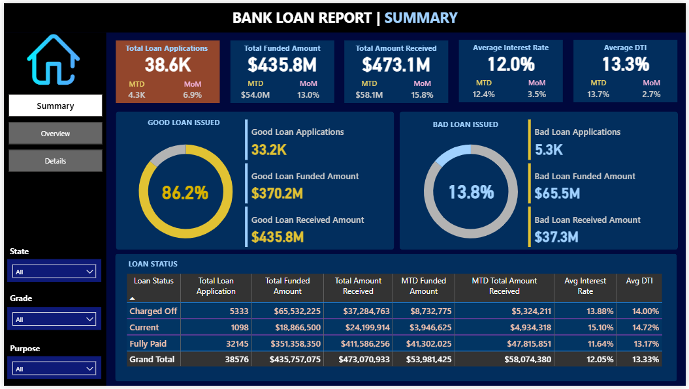
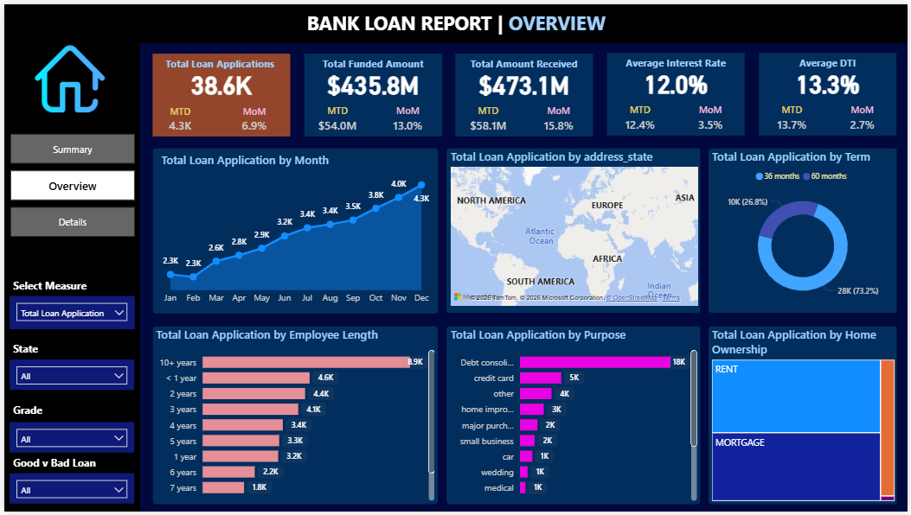
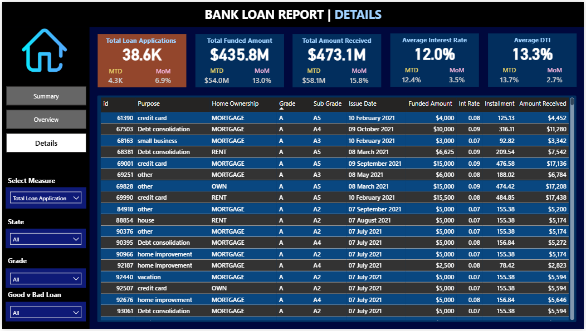

# 🏦 Bank Loan Analysis Dashboard

### Power BI | SQL Server | Data Modeling | Finance Domain

## 📋 Problem Statement
A financial institution required a comprehensive loan monitoring system to track application trends, evaluate loan performance, and classify Good vs Bad loans for data-driven risk management.

## 📊 Project Overview
Analyzed bank loan application data using MS SQL Server and Power BI to extract financial KPIs, perform risk analysis, and build an interactive 3-page dashboard.

## 🛠️ Tools & Technologies
- MS SQL Server — Data storage and KPI queries  
- Power BI Desktop — Dashboard development and visualization  
- Power Query — Data cleaning and transformation  
- DAX — Calculated measures and KPIs  
- Data Modeling — Table relationships and date table creation  

## 📌 Key Features
- KPI Tracking — Total applications, funded amount, amount received, average interest rate, and average DTI  
- Good Loan vs Bad Loan classification and analysis  
- Monthly trend analysis by issue date  
- Regional analysis by state using map visuals  
- Loan term, purpose, and home ownership breakdown  
- Employee length analysis  
- 3-page dashboard — Summary, Overview, and Details  

## 📈 Business Questions Answered
- What is the total loan applications and funded amount?  
- What percentage of loans are Good vs Bad?  
- Which states have the highest loan applications?  
- What are the monthly trends in loan issuance?  
- How do loan purpose and term impact performance?  

## 🔗 Dashboard Preview
  
  
  

## 📁 Files
- `SQLQuery1.sql` — SQL queries used for data analysis  
- `Bank Loan.pbix` — Power BI dashboard file  
- `financial_loan.csv` — Raw dataset  

## 🚀 Conclusion
This project demonstrates end-to-end data analysis using SQL Server and Power BI, enabling effective loan monitoring, risk classification, and financial decision-making through interactive dashboards.
